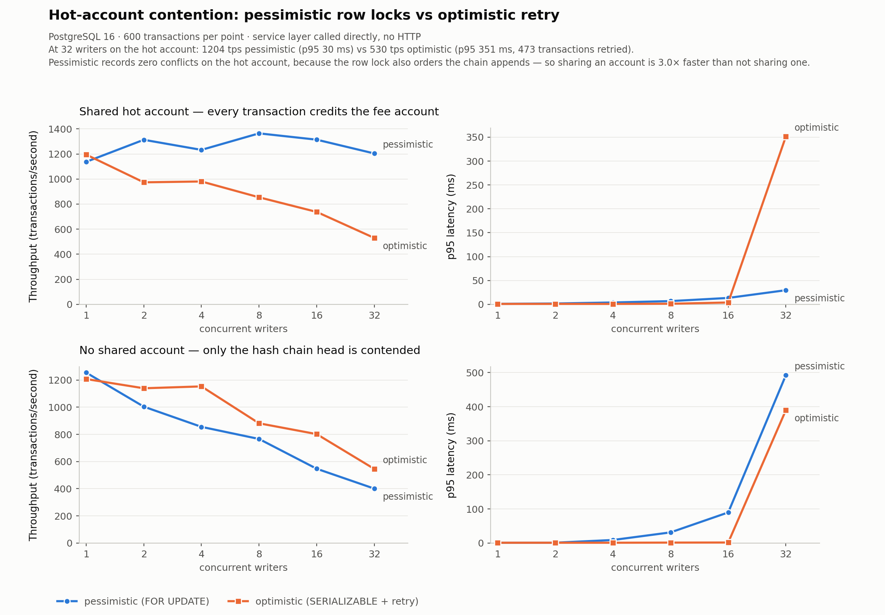

# Ledger

A double-entry ledger service. Python 3.12, FastAPI, PostgreSQL 16, raw SQL with
explicit transaction boundaries.

The interesting part of a ledger is not the feature list, it is what happens
under retries, concurrency, and crashes. So this README is six sections, each of
the form: **the production problem → my design → the proof it works.** The proof
is always a test you can run or a number you can reproduce, never an assertion
that the design is sound.

218 tests against a real PostgreSQL, 11 reconciliation checks, a hot-account
benchmark with numbers, and a chaos runner that killed the server 15 times across
30,179 operations without breaking an invariant.

```
make db-local-up     # throwaway Postgres 16 in ./.pgdata (or: make up, for Docker)
make migrate
make seed
make test            # 218 tests, ~46s
make run             # API on :8000
```

`make test-fast` skips the four slow tests (chaos and the stateful properties).
Detailed reasoning for every decision below, including the alternatives that lost
and why, is in [`docs/decisions.md`](docs/decisions.md).

---

## 1. Balances are a lie you tell yourself

**The problem.** The obvious ledger schema has `accounts.balance`, and you
`UPDATE` it on every payment. This works until it doesn't, and when it doesn't
you have no way to find out what the balance *should* have been. A bug that
double-applies a debit produces a wrong number with no audit trail, and there is
nothing to reconcile against because the wrong number is the only record. The
same applies to `UPDATE`-ing or `DELETE`-ing history to "fix" a mistake: you have
destroyed the evidence of what you did.

**My design.** Balances are never stored as authoritative state. A balance is
`SUM(entries.amount_minor)`, computed on read. Entries are append-only;
corrections are new reversing transactions. `account_balances` exists as a cache,
but nothing on the write path reads it — the overdraft check queries `entries`
directly. Its only consumer is `GET /reconciliation`, which proves it matches.

Amounts are `BIGINT` minor units. There is no float and no `Decimal` in the money
path, so there is no rounding mode to agree on. Requests use Pydantic `StrictInt`:
`100` is accepted, `100.0` and `"100"` are rejected at the edge rather than
silently coerced.

Every rule is enforced twice — once in application code so the client gets a clear
error, and once in Postgres so a future code path cannot skip it:

| Invariant | Database mechanism |
|---|---|
| Entries and transactions are append-only | statement-level `BEFORE UPDATE/DELETE/TRUNCATE` triggers |
| Entries sum to zero **per currency** | `CONSTRAINT TRIGGER … DEFERRABLE INITIALLY DEFERRED` |
| No orphan or single-entry transactions | deferred trigger on `transactions` |
| An entry's currency matches its account's | composite FK `(account_id, currency)` → `accounts(id, currency)` |
| One settlement / revenue / liquidity account per currency | partial unique index |
| The hash chain cannot fork | `UNIQUE(prev_hash)`, genesis = 32 zero bytes |

Two of those are worth a second look. The zero-sum check has to be **deferred**,
because a transaction is legitimately unbalanced after its first entry is
inserted — the set of entries is only complete at `COMMIT`, so that is the only
correct time to check. And it groups **by currency**: summing across currencies
would let `+100 USD` and `-100 CAD` look balanced, which is a money printer.

The currency-agreement rule is a foreign key rather than a check. Adding
`UNIQUE (id, currency)` to `accounts` costs one redundant index and turns "an
entry's currency always matches its account" from a rule that *runs* into a shape
that cannot be expressed wrongly. There is no trigger order or
`session_replication_role` setting under which a USD entry can reference a CAD
account, because no such parent row exists.

**The proof.** `tests/test_phase1_db_guards.py` (15 tests) writes raw SQL to
bypass the service layer entirely, because a rule that only exists in Python is
one forgotten call site away from being absent.

The deferred constraint has a test that proves it is *actually* deferred — both
unbalanced inserts succeed, the row count is asserted mid-transaction, and
`COMMIT` is what raises:

```python
with pytest.raises(psycopg.errors.CheckViolation) as exc:
    with db.transaction() as cur:
        tx_id = f.raw_insert_transaction(cur)
        # insert +100 and -50, both succeed
        cur.execute("SELECT count(*) AS n FROM entries WHERE transaction_id = %s", (tx_id,))
        assert cur.fetchone()["n"] == 2      # the constraint has not fired
assert "unbalanced_transaction" in str(exc.value)   # COMMIT raised
```

And `test_balance_is_derived_from_entries_not_the_cache` corrupts
`account_balances` to `999_999` behind the service's back and asserts the reported
balance stays at `1_000`. The drift is real; the truth is elsewhere.

**What this does not buy.** A table owner can `ALTER TABLE … DISABLE TRIGGER` and
rewrite whatever they like — `tests/conftest.py:reset_database()` does exactly
that, on purpose, so the limit is visible in the codebase rather than implied.
Prevention stops the application. Section 6 is what detects the administrator.

---

## 2. Idempotency under concurrent retries

**The problem.** A client posts a payment. The connection drops before the
response arrives. The client has no idea whether the money moved, so it retries.
Meanwhile its first request is still in flight. Now two identical requests are
being processed concurrently, and the obvious defence —

```sql
SELECT * FROM idempotency_keys WHERE key = ?;   -- no row
INSERT INTO idempotency_keys ...;               -- both requests get here
```

— has a window between the two statements in which both see "no row" and both
process. Concurrent retries are the *only* situation this feature exists for, and
that is precisely where check-then-insert fails.

**My design.** Insert-first, in the same transaction as the business write:

```
BEGIN
  INSERT INTO idempotency_keys (key, request_hash) VALUES (?, ?)
  ON CONFLICT (key) DO NOTHING
  -- rowcount 1 -> we own the key, do the work
  -- rowcount 0 -> someone else owns it, replay their stored response
  UPDATE idempotency_keys SET response_body = ?, status_code = ?
COMMIT
```

The unique index *is* the concurrency control. There is no application-level
coordination, no advisory lock, and no state machine.

The subtle part is what happens to the loser. Under READ COMMITTED,
`INSERT … ON CONFLICT DO NOTHING` against a row inserted by an **uncommitted**
transaction does not return "already exists" — it blocks on that transaction. So
the second request waits and then sees a settled outcome: if the first committed,
read its stored response and replay it; if it rolled back, no conflicting row
remains and we process normally. That is exactly the behaviour you want, and it
comes from the database rather than from our code.

A replay returns the **original status code** (201, not 200) with
`"replayed": true` added. The client's question is "did my request happen", and
the truthful answer is the answer the first attempt gave. The stored body is
echoed byte-for-byte rather than re-serialised, so replay stays faithful if the
response model later gains a field.

Same key with a *different* body is a 409. The fingerprint is hand-written per
request type rather than a hash of the raw HTTP body, which buys two things a
generic hash cannot: the operation name is part of the identity (so one key cannot
be used for both `POST /transactions` and `POST /holds/{id}/capture`), and
normalisation is a per-field decision. Entry order in a transaction is
semantically meaningless — the hash chain sorts entries too — so the fingerprint
sorts them, and a client that retries with its legs reordered gets a replay
instead of a spurious 409. Sorting preserves the multiset, so no two genuinely
different requests can collide.

**One deliberate divergence from Stripe:** a failed request does **not** consume
its key. The rollback takes the reservation with it, so a client that fixes its
payload can reuse the key. Recording error responses the way Stripe does requires
committing the key row in a transaction *separate* from the one that failed —
which is a dual write, and reintroduces the exact atomicity problem this feature
removes, now with the twist that a crash between the two leaves a key permanently
refusing a payment that never happened. The cost of my choice, stated plainly: an
idempotency key here does not protect a client that retries a
*validation*-rejected request and succeeds the second time because account state
changed in between.

**The proof.** The required test — two concurrent identical requests, exactly one
set of entries — is `test_two_concurrent_identical_requests_write_exactly_one_set_of_entries`,
and it also passes at 4× and 16× concurrency.

But the more useful test asserts the *mechanism*:
`test_concurrent_claim_blocks_until_the_owner_commits` holds the owning
transaction open, asserts the contender has **not** returned after a second,
queries `pg_stat_activity` to confirm it is genuinely waiting on a lock, then
commits and asserts the contender wakes up and inserts nothing. That is the
difference between observing the right outcome and knowing why you got it.

20 tests in `tests/test_phase2_idempotency.py`, including reordered-entry replay,
swapped-direction 409, cross-endpoint key reuse, and replay across a dropped
connection pool.

---

## 3. The hot-account problem

**The problem.** In a real payments system, every single payment credits the
platform's fee account. That one row is touched by every write in the system, so
it is a serialization point by construction — you cannot enforce a balance
invariant on a row without ordering the writers that touch it. The question is
not how to avoid the serialization. It is how to pay for it: queue and wait, or
proceed optimistically and throw away work when you lose.

**My design.** Both, switchable by config, differing in **exactly one function**:

```python
def acquire_accounts(cur, account_ids, strategy):
    if strategy == "pessimistic":
        return lock_accounts(cur, account_ids)   # SELECT … FOR UPDATE, READ COMMITTED
    if strategy == "optimistic":
        return load_accounts(cur, account_ids)   # plain SELECT, SERIALIZABLE + retry
```

Everything downstream — the overdraft check, the append, the balance cache, the
hash chain — is byte-for-byte identical. That was a design constraint, not an
accident: if the paths diverged in several places the benchmark would be comparing
two implementations rather than two disciplines.

The pessimistic path sorts account ids and relies on Postgres putting the
`LockRows` node at the top of the plan, so rows are locked in the order the plan
emits them. Without a single global ordering, transaction A holding account 1 and
wanting 2 while B holds 2 and wants 1 is a deadlock.

The retry classifier returns a *reason*, not a boolean, and this is the most
dangerous place in the codebase to be sloppy: `40001` and `40P01` are always
retryable, but `23505` (unique violation) is retryable **only** for the hash-chain
constraints. A blanket "retry all unique violations" would retry an
idempotency-key collision and defeat section 2 entirely.

**The proof.**



PostgreSQL 16, 600 transactions per point, service layer called directly (no HTTP
— the question is about database contention, and a web stack in the path adds
scheduling noise unrelated to row locks). Raw data in
[`docs/hot-account-benchmark.json`](docs/hot-account-benchmark.json); reproduce
with `make loadtest`.

| workload | strategy | 1 writer | 32 writers | p95 @ 32 | conflicts @ 32 |
|---|---|---|---|---|---|
| shared hot account | pessimistic | 1070 tps | **1202 tps** | 32 ms | **0** |
| shared hot account | optimistic | 1139 tps | 526 tps | 399 ms | 489 serialization failures |
| no shared account | pessimistic | 1147 tps | 529 tps | 348 ms | 771 chain conflicts |
| no shared account | optimistic | 1013 tps | 493 tps | 420 ms | 571 serialization failures |

Pessimistic locking wins the hot-account case by 2.3× throughput and 12× p95. That
much was expected: a queue does no wasted work, whereas every optimistic abort
discards a transaction that had already done its reads. The bimodal latency is the
visible signature — optimistic p50 stays around 1 ms while p95 blows out to 399 ms,
because the winners are fast and the losers pay for a full replay.

**The result I did not expect is the bottom half of the table.** Pessimistic
throughput on the shared hot account (1202 tps) is **2.3× its throughput with no
shared account at all** (529 tps). Sharing a row made it faster.

The explanation is the hash chain from section 6. Appending to it is a global
serialization point: every writer reads the same chain head and `UNIQUE(prev_hash)`
rejects all but one. In the hot-account workload, the row lock on the shared fee
account *incidentally orders the chain appends too* — writers queue on the account,
so they reach the chain one at a time and never collide. The retry counter proves
it: **zero conflicts of any kind, at every concurrency level.** Remove the shared
account and nothing imposes that order, so the same strategy records 771 chain
conflicts and loses 56% of its throughput.

This is why the classifier returns a reason rather than a boolean. Throughput alone
cannot tell you *what* the writers were fighting over; the per-kind breakdown can,
and it turns a surprising number into an explained one.

So this service has two serialization points — the hot account row and the chain
head — and the benchmark measures both. The chain is the harder ceiling, because
unlike an account it cannot be sharded away; it is one linked list by construction.
What I would build next, in order: an advisory lock around the chain append
(converts aborts into queueing, which the numbers show is strictly cheaper);
periodic sealing instead of per-transaction chaining (removes the serialization
point entirely, at the cost of coarser tamper evidence — you learn which *batch*
was altered); and a conflict-free balance cache using append-only deltas, since a
credit-only fee account needs no overdraft check and therefore no serialized read.

`tests/test_phase4_concurrency.py` (20 tests) parameterises every correctness test
over both strategies, because comparing the performance of a correct
implementation against a subtly broken one is worthless. It also asserts the
`LockRows` plan shape via `EXPLAIN`, and that an idempotency-key collision is
never classified as retryable.

---

## 4. Holds are promises, not movements

**The problem.** A card authorization reserves money without moving it. If you
model that by debiting the customer and crediting a "pending" account, you have
moved money that no merchant has claimed, and your balances now describe a state
of the world that isn't true. If you model it as a mutable "reserved" column, you
are back to section 1. And whichever you choose, the reservation has to expire —
which is where the real bug lives.

**My design.** A hold writes **no entries**. It reduces what an account may spend
without changing what the account has:

```
available = SUM(entries) − SUM(live holds)
live  ⇔  status = 'pending' AND expires_at > now()
```

That `expires_at` predicate is the most important line in the phase. If
availability trusted `status` alone, the background expiry worker would be the
thing that releases customer money — and an outage in a background worker would
silently freeze funds, with no error anywhere and no failing invariant. Instead a
hold stops reserving the instant it lapses, whether or not any job has run. The
sweeper only keeps the partial indexes small and the `status` column honest. **A
background job may fix up representation, never correctness.**

Capture writes the real entries, may be partial, and releases the remainder. The
ordering inside the capture transaction is load-bearing:

1. `SELECT … FOR UPDATE` the hold; assert `pending` and not lapsed
2. `UPDATE holds SET status = 'captured', captured_transaction_id = <new uuid>`
3. lock accounts, check overdraft, append the transaction

The hold is retired **before** the entries are written. The overdraft check reads
live holds, so if this hold were still `pending` it would count the reserved
amount *and* the debit that consumes it — the same money subtracted twice — and a
full capture against a fully-reserved account would be rejected.

Retiring first also makes the check a provable no-op rather than a constraint.
With the hold retired, available rises by the full authorized amount `H`, and the
capture is for `C ≤ H`. If `available = actual − held ≥ 0` before, then after
retiring `available' = available + H ≥ H ≥ C`. So **capture cannot fail for lack
of funds** — if it ever does, an invariant broke elsewhere and the exception is
the alarm. This is what a hold is *for*: once authorized, the merchant gets paid.

That ordering is also why `holds.captured_transaction_id` has a **DEFERRABLE**
foreign key — step 2 points at a transaction that does not exist until step 3.

The captured amount is derived from the capture transaction's entries, not stored,
for the same reason balances are. Which is *why* a capture may not credit the
account the hold is against: the held account would appear as both a debit and a
credit, the sum over it would net the two, and the captured amount would be
unrecoverable.

Terminal states are terminal, and the authorized amount is immutable — both by
trigger, not convention. Raising the authorized amount after the fact is the hold
equivalent of editing a signed cheque. And `(status = 'captured')` is tied to
`(captured_transaction_id IS NOT NULL)` by a single biconditional CHECK: `captured`
with no link is a capture that moved no money, and a link on a voided hold is a
movement nobody authorized. One line forbids both, and there is no third case to
forget.

**The proof.** The check-then-act races are tested directly rather than argued
about. 20 threads each holding 100 against a 1,000 balance → **exactly 10 succeed,
10 get `insufficient_funds`.** Same for concurrent debits, same for a mixed
hold/debit workload, and two concurrent captures of one hold → exactly one wins.

`test_capture_provably_cannot_overdraft` pins the boundary case: every cent held,
available exactly zero, full capture succeeds.
`test_a_lapsed_hold_stops_reserving_funds_before_any_sweep` asserts the row still
reads `pending` while the money is already available.

48 tests in `tests/test_phase3_holds.py`.

---

## 5. The dual-write problem

**The problem.** Post the transaction, then notify the webhook. Those are writes
to two systems with no transaction spanning them, so a crash between them produces
a lie — and there is no ordering that avoids it. Notify first and the crash means
you announced a payment that never happened. Write first and the crash means a
payment nobody was ever told about. Adding a queue does not help; it just moves
the boundary.

**My design.** Remove the second system from the critical path. The event is
inserted into *this* database, in the same transaction as the entries:

```python
def emit(cur: Cursor, event_type: str, payload: dict) -> int:
```

It takes a **cursor**, not a connection. That signature is the design: a version
of this function that managed its own transaction would silently reintroduce the
dual write it exists to remove. And it is called from inside
`append_transaction`, not from the individual services — every entry this service
writes goes through that function, so "a committed transaction always has an
event" is structurally true rather than a rule each new call site must remember.

Delivery then becomes a separate problem against durable state, which is a problem
retries can solve. The relay claims a batch, **commits**, and only then makes the
HTTP call — because an HTTP call inside a database transaction holds a row lock
for a network round trip and makes the database's availability depend on a third
party's. The claim doubles as a **lease**: it pushes `next_attempt_at` forward, so
a relay that dies mid-delivery releases its events automatically with no separate
reaper.

The consequence is deliberate. A relay that dies after claiming and before
recording delivers twice. That is at-least-once, and it is the strongest guarantee
available without a transaction spanning both systems. Exactly-once is completed
at the **receiver**, by discarding event ids it has already seen. There is no way
to move that responsibility upstream.

Two details worth calling out. First, **the relay never uses a high-water mark.**
`WHERE id > last_seen_id` silently loses events: sequence values are handed out
before commit, so the transaction holding id 5 can commit before id 4, and a
reader that reaches 5 will never look at 4 again. This relay keys off
`status = 'pending'`, so an event is only dismissed once its outcome is recorded.
That is the most common way a hand-rolled outbox is wrong, and it is invisible
under light load.

Second, ordering: events are claimed `ORDER BY id` and delivered sequentially, so
on the happy path a consumer sees commit order. **Retries break that.** The
alternative — head-of-line blocking — buys strict ordering at the price of letting
one poison event stop notifications for every account in the system. For a
payments notification stream that is the wrong trade.

**The proof.** `scripts/receiver.py` is a webhook receiver that fails 30% of
requests. The important detail is *where*: it **records the event and then returns
500**. That is the failure mode that actually tests the contract — the event was
processed and the acknowledgement was lost — so every injected failure produces a
genuine duplicate. A receiver that failed before processing would only test that
retries happen, which is the easy half.

A 41-event run at a 30% failure rate:

```
relay : claimed=63  delivered=41  retried=22  dead=0
recv  : unique=41   requests=63   duplicates=22   max_attempts_for_one_event=4
```

The assertions that matter are not "it worked" but "the guarantee was exercised":
`failures_injected > 0`, `duplicates > 0`, and `request_count > unique_events`.
Without those three, the test could pass by the fault injection silently doing
nothing.

`test_the_ledger_is_unaffected_by_delivery_failure` makes the endpoint entirely
unreachable, lets events dead-letter, and asserts balances are correct and all 11
reconciliation checks pass. The outbox is what makes notification an availability
concern rather than a correctness one.

`every_transaction_has_an_outbox_event` is the reconciliation check that would
catch someone refactoring the emit out into its own transaction. 23 tests in
`tests/test_phase6_outbox.py`. Events are HMAC-signed over the exact bytes on the
wire, and the receiver uses `hmac.compare_digest` rather than `==`.

---

## 6. Tamper evidence, and surviving crashes

**The problem.** Section 1's triggers stop the application from rewriting history.
They do nothing about someone with database access who runs
`ALTER TABLE … DISABLE TRIGGER` and edits one amount in one historical row. And
separately: every invariant in this service assumes uncommitted work vanishes on a
crash. That assumption is worth testing rather than believing.

**My design — evidence.** Each transaction stores `prev_hash` (its predecessor's
`tx_hash`) and its own `tx_hash` = SHA-256 over a canonical serialization of
`(id, created_at, sorted entries, prev_hash)`. Changing any hashed field changes
that row's hash, which breaks the link its successor stores, which breaks every
link after it. `GET /integrity` recomputes the whole chain and reports the first
break.

The canonical form is a bespoke newline-delimited text format, not JSON, because
JSON has no single canonical encoding — key order, whitespace, unicode escaping
and integer rendering are all implementation-defined, so two correct JSON
serializers can hash the same value differently and a verifier written in another
language could report a false break. `created_at` is generated in Python rather
than by `DEFAULT now()`, because the writer has to know the exact microsecond it
is hashing.

`UNIQUE(prev_hash)` is the load-bearing constraint: two rows cannot claim the same
predecessor, so history is a line and not a tree. Genesis uses 32 zero bytes
rather than `NULL`, because Postgres permits unlimited `NULL`s in a unique index
and a `NULL` genesis would allow many parallel chains.

Stated plainly: this proves **evidence** of tampering, not prevention. Anyone who
can disable triggers can rewrite the entire chain consistently. What it defeats is
a targeted edit — silently changing one amount without anyone noticing.

**My design — crash survival.** `scripts/chaos.py` starts the API as a real
subprocess, drives it with randomized traffic from several threads (transfers,
holds, captures, voids, FX, and deliberate replays of already-used keys), and
kills it at random intervals — 80% `SIGKILL`, which severs the process
mid-statement with no chance to flush or roll back. While the server is down and
the database is quiescent, it runs all 11 reconciliation checks and the chain walk,
and aborts on the first violation. Each restart re-rolls the concurrency strategy,
so one run exercises both section-3 code paths against the same accumulating data.

Then the part reconciliation cannot do. Reconciliation proves the ledger is
*internally consistent*; it has no idea what any client was told. So every request
is recorded with its client-observed outcome, and at the end every idempotency key
is replayed with a byte-identical body, asserting: a request the client saw succeed
has exactly one transaction whose entries are **exactly** the ones requested; a
request the client saw rejected has none; a request whose outcome the client never
learned has all of its entries or none; and replaying creates no second transaction
for a key that already had one.

**The proof.** `python -m scripts.chaos --duration 120 --workers 8 --seed 20260827`:

| | |
|---|---|
| operations sent | 30,179 |
| **outcome unknown** (killed mid-request) | **1,611** |
| transactions committed | 21,681 |
| server kills | 15 (12 SIGKILL, 3 SIGTERM) |
| full invariant checks | 18 |
| **violations** | **0** |
| replay verification | 19,877 replayed, 995 newly processed, **0 duplicated** |
| outbox | 32,505 events, 38,195 requests, 5,690 duplicates, **0 lost, 0 dead** |

The 1,611 unknown-outcome requests are the ones that matter — clients killed
mid-request that genuinely could not know whether their write landed. Every one
resolved to exactly one outcome.

The outbox line is sections 5 and 6 together: the relay lives in the server, so
each kill severed deliveries in flight. Those events came back through the lease
mechanism, were redelivered, and the receiver's dedup absorbed all 5,690
duplicates.

For tamper evidence, `test_editing_a_hashed_field_breaks_the_chain` is the one that
matters: it shifts a `created_at` by a day — hashed, but affects no balance — and
asserts that every other reconciliation check still passes and **only**
`hash_chain_intact` fails. That is precisely the attack this exists to catch: an
edit that leaves the books adding up.

`tests/test_phase7_properties.py` drives a Hypothesis state machine over random
operation sequences, re-checking global zero-sum per currency, no negative
available balances, no orphaned entries, and idempotency after **every step**.

Two things I got wrong there, both worth recording:

- **The property suite was not testing what it claimed.** Accounts were funded
  500,000 while amounts drew up to 20,000, so over ~25 steps they never ran out of
  money. I checked by mutation — deleted the body of `assert_no_overdraft`
  entirely, and the suite **still passed**. Funding is now 25,000, and the same
  mutation fails immediately with `AssertionError: account … actual -1`. A green
  property test proves nothing about a path the generator never reaches; the
  mutation check is cheap and should be the default way to confirm a property test
  has teeth.
- **Bundle pollution.** Rules returned `None` when an operation was rejected,
  which puts `None` *into* the Hypothesis bundle, so downstream rules spent steps
  on values they had to skip — 5 invalid examples, 92% retried draws. Returning
  `multiple()` plus two `@initialize` rules took it to 0 invalid examples.

The chaos run also found a real bug: every non-2xx response was being retried until
the attempt budget ran out, so a misconfigured webhook secret burned all 30 retries
on 401s per event. A 4xx that is not 408/425/429 now dead-letters on the first
attempt.

---

## Reference

### API

| | |
|---|---|
| `POST /accounts` | create an account |
| `POST /transactions` | post entries; requires `Idempotency-Key` |
| `POST /holds` | authorize; requires `Idempotency-Key` |
| `POST /holds/{id}/capture` | full or partial capture; requires `Idempotency-Key` |
| `POST /holds/{id}/void` | release; requires `Idempotency-Key` |
| `POST /fx/convert` | cross-currency conversion; requires `Idempotency-Key` |
| `GET /accounts/{id}/balance` | `actual`, `held`, `available` |
| `GET /accounts/{id}/entries` | keyset-paginated history |
| `GET /reconciliation` | 11 invariant checks |
| `GET /integrity` | walks the hash chain, reports the first break |
| `GET /outbox/stats` | delivery backlog and lag |

FX writes five entries, not four — a spread credited to `platform_revenue` needs
its own leg in a real currency, so four entries and a nonzero spread are mutually
exclusive. The four-entry structure is exactly the `spread = 0` case. The caller
states both `sell_amount_minor` and `buy_amount_minor` as integers; the service
never applies a rate, because multiplying money by a non-integer means choosing a
rounding direction and the residue has to be credited somewhere. That decision
belongs with the quoting engine.

### Layout

```
ledger/
  db.py             transaction boundaries — literal BEGIN/COMMIT/ROLLBACK
  hashing.py        canonical serialization + SHA-256 chain
  money.py          int64 minor units; no float anywhere
  services/
    posting.py      the ONE write primitive everything funnels through
    idempotency.py  insert-first claim + replay
    holds.py        authorization state machine
    fx.py           cross-currency conversion
    outbox.py       transactional outbox + relay
    reconciliation.py   11 checks, one snapshot
    integrity.py    chain walk
migrations/         001 core · 002 idempotency · 003 holds · 004 fx · 005 outbox
scripts/            migrate · seed · reconcile · loadtest · relay · receiver · chaos
```

Every database transaction in the service is opened by `db.transaction()` or
`db.run_in_transaction()` and nothing else. Both issue literal `BEGIN` / `COMMIT` /
`ROLLBACK` against a connection in autocommit mode, so psycopg is not managing
transactions on our behalf and the boundaries are exactly the lines you can read
in `db.py`. The recurring bug in ledger code is a write that commits in a
different transaction than the check that authorised it; if the only way to open a
transaction prints its own `BEGIN`, that class of bug becomes visible in review.

### Tests

| file | tests | |
|---|---|---|
| `test_phase1_db_guards.py` | 15 | database invariants, via raw SQL |
| `test_phase1_ledger.py` | 25 | posting, derived balances, hash chain |
| `test_phase1_api.py` | 12 | HTTP contract |
| `test_phase2_idempotency.py` | 20 | replay, 409, concurrent retries |
| `test_phase3_holds.py` | 48 | state machine, partial capture, expiry, races |
| `test_phase4_concurrency.py` | 20 | both strategies, lock ordering, conflict classification |
| `test_phase4_reconciliation.py` | 26 | every check, against a corrupted database |
| `test_phase5_fx.py` | 21 | entry structure, spread denomination, minor units |
| `test_phase5_properties.py` | 6 | model-based FX properties |
| `test_phase6_outbox.py` | 23 | atomicity, leases, exactly-once, signing |
| `test_phase7_properties.py` | 1 | Hypothesis state machine |
| `test_phase7_chaos.py` | 1 | short chaos run |
| | **218** | |

Tests run against a real PostgreSQL 16, never a mock or SQLite — most of the
invariants here are enforced by Postgres itself (deferred constraint triggers,
composite foreign keys, row locks, SERIALIZABLE conflict detection), so a test
against a stand-in would be testing nothing that matters.

The reconciliation tests deserve a note: **every check is exercised against a
deliberately corrupted database.** A reconciliation suite that has only ever run
against a healthy ledger might be eleven queries that can never fail. One check
turned out to be unprovokable — `non_captured_holds_have_no_transaction` cannot be
made to fail, because `session_replication_role` suppresses triggers but a CHECK
constraint is not a trigger. That is recorded rather than hidden, the check is kept
(it would catch a future migration relaxing the CHECK), and the test asserts the
database's refusal instead.

### Known limits

- The hash chain is a global serialization point and the throughput ceiling of the
  service. Measured, not hidden — section 3, with the three mitigations I would
  build next.
- A capture's destination is not authorized at hold time. Whoever can capture a
  hold chooses where the money lands. Putting `destination_account_id` on `holds`
  would fix it and is the stronger design for a real system.
- Nothing caps how negative a liquidity pool can go. That is a treasury policy
  decision the ledger has no way to evaluate correctly; the position is always
  visible as `SUM(entries)`.
- Idempotency keys are never expired. `transactions.idempotency_key` is a foreign
  key into `idempotency_keys`, so the row cannot be dropped. The intended fix is to
  prune the *payload* and keep the row as the authorization record; the replay path
  already handles the pruned case, but the retention job is not built.
- `docker-compose.yml` is committed and targets the same DSN as the local
  Homebrew cluster, but I developed against the latter and have not exercised the
  Docker path.
